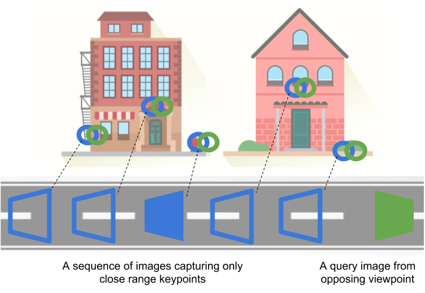
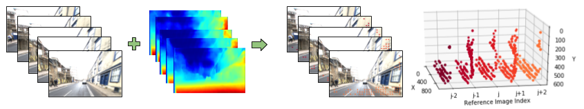

## Look No Deeper: Recognizing Places from Opposing Viewpoints under Varying Scene Appearance using Single-View Depth Estimation

This is the source code for the paper titled: "Look No Deeper: Recognizing Places from Opposing Viewpoints under Varying Scene Appearance using Single-View Depth Estimation", [[arXiv](https://arxiv.org/abs/1902.07381)][[IEEE Xplore](https://ieeexplore.ieee.org/abstract/document/8794178/)].

If you find this work useful, please cite it as: 
Garg, S., Babu V, M., Dharmasiri, T., Hausler, S., Suenderhauf, N., Kumar, S., Drummond, T., & Milford, M. (2019). Look no deeper: Recognizing places from opposing viewpoints under varying scene appearance using single-view depth estimation. In IEEE International Conference on Robotics and Automation (ICRA), 2019. IEEE.

bibtex:
```
@inproceedings{garg2019look,
title={Look No Deeper: Recognizing Places from Opposing Viewpoints under Varying Scene Appearance using Single-View Depth Estimation},
author={Garg, Sourav and Babu V, Madhu and Dharmasiri, Thanuja and Hausler, Stephen and Suenderhauf, Niko and Kumar, Swagat and Drummond, Tom and Milford, Michael},
booktitle={IEEE International Conference on Robotics and Automation (ICRA)},
year={2019}
}
```






#### Requirements
- Ubuntu	(Tested on *16.04*)
- Jupyter	(Tested on *4.4.0*)
- Python	(Tested on *3.5.6*)
  - numpy	(Tested on *1.15.2*)
  - scipy	(Tested on *1.1.0*)

Optionally, for vis_results.ipynb:
  - Matplotlib	(Tested on *2.0.2*)

#### Download an example dataset and its pre-computed representations
1. In `seq2single/precomputed/`, download [pre-computed representations (*~10 GB*)](https://mega.nz/#F!Z4Z3gAzb!KI48uGHJJza90DP7-Kz1kA). Please refer to the `seq2single/precomputed/readme.md` for instructions on how to compute these representations.

2. [Optional] In `seq2single/images/`, download [images (*~1 GB*)](https://mega.nz/#F!h5QB2ayI!H7p0UCxATd6MUdszMZWNOA). These images are a subset of two different traverses from the [Oxford Robotcar dataset](https://robotcar-dataset.robots.ox.ac.uk/).

(Note: These download links from Mega.nz require you to first create an account (free))

#### Run
1. The Jupyter notebook seq2single.ipynb first loads the pre-computed global image descriptors to find top matches. These matches are re-ranked with the proposed method using the pre-computed depth masks and dense conv5 features.


#### License
The code is released under MIT License.

## Related Projects
[Delta Descriptors (2020)](https://github.com/oravus/DeltaDescriptors)

[CoarseHash (2020)](https://github.com/oravus/CoarseHash)

[LoST (2018)](https://github.com/oravus/lostX)
